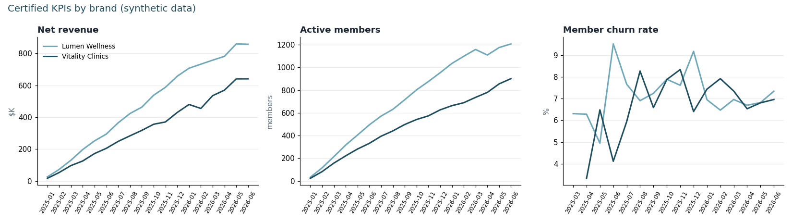
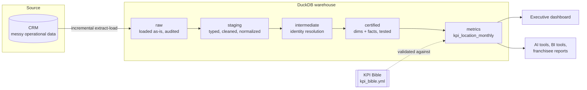

# Multi-Location Data Platform Blueprint

From manual Excel reporting to a certified, tested data platform, for a multi-location, multi-brand business.

This is a runnable, scaled-down version of a data platform I designed and built from scratch at a multi-location healthcare organization. Before it existed, every report was exported from the CRM and computed by hand in Excel. Everything here runs on **synthetic data** for a fictional two-brand clinic chain; no real company, patient or financial data is included.


**Live dashboard:** [open the interactive dashboard](https://quanti-nomad.github.io/multi-location-data-platform/dashboard.html)

## Before and after

| | Before: manual reporting | After: this platform |
| --- | --- | --- |
| Getting data | Export CRM reports, paste into Excel | Automated incremental ingestion, logged per batch |
| Definitions | Each report computes "revenue" its own way | One KPI Bible; every metric defined once |
| Data quality | Found by whoever notices a wrong number | 45 automated tests run before anything is published |
| Duplicates, test accounts | Counted as real customers | Merged and removed, with a test proving every record is accounted for |
| Trust | "Which spreadsheet is right?" | Revenue ties to the source system to the cent, every run |
| New location or brand | Rebuild the spreadsheets | Add a row to the source; the pipeline picks it up |

## Architecture



The layers follow one rule: **only certified models may be used for reporting.** Raw data is never edited, cleaning happens once in staging, and anything a dashboard, franchisee report or AI tool reads has passed its tests and carries an owner and certification tier in its dbt metadata.

## What the platform handles

The synthetic CRM is deliberately messy, the way real operational systems are:

| Problem in the source | How the platform handles it |
| --- | --- |
| 10 spellings of 3 appointment statuses ("Complete", "NoShow", "canceled"...) | Normalized to a controlled vocabulary; an unmapped new spelling fails a test |
| 16 hand-typed lead sources ("FB", "facebook", "Facebook Ads"...) | Mapped to 5 marketing channels |
| Payment amounts stored as text, some as "$1,234.50" | Parsed to integer cents |
| 534 voided payments and refunds mixed with sales | Voids excluded, refunds netted |
| 279 duplicate customer records (same person, email typed differently) | Merged into one customer |
| 30 staff test accounts | Removed from every certified table |
| Location names with stray spaces and mixed casing | Standardized |
| A location that closed, with refunds posting after closure | Kept in reporting until its last financial activity, so no revenue disappears |

Result: 9,287 raw customer records become 8,978 certified customers, and $14.7M in net revenue ties exactly to the source across 24 locations and 18 months.

## What the tests caught while I built this

Two real bugs surfaced during development. They are the reason the tests exist.

1. **Refunds after a location closed vanished from the KPI table.** The KPI table only covered months a location was open, so post-closure refunds had nowhere to land. The KPI-to-ledger tie-out test failed on the first run. Fix: closed locations stay in reporting through their last financial activity.
2. **Customers without an email were silently dropped.** The test-account flag evaluated to null instead of false for them, so every "exclude test accounts" filter removed them too. The revenue tie-out test had the same blind spot, so the two agreed while both being wrong. An independent record-count test caught it. Fix: the flag can never be null, and a test now enforces that.

## The KPI Bible

Every metric used in reporting is defined once in [`kpis/kpi_bible.yml`](kpis/kpi_bible.yml) with its definition, formula, grain, source column and certification tier (board, executive or operational). On every run, [`validate_kpis.py`](kpis/validate_kpis.py) checks that each KPI points at a certified model and a column that actually exists. If not, the pipeline stops before any dashboard is built.

See the generated [KPI Bible](docs/kpi_bible.md) and the [last run report](docs/last_run.md).

## Quick start

```bash
git clone https://github.com/quanti-nomad/multi-location-data-platform.git
cd multi-location-data-platform
pip install -r requirements.txt

python pipeline.py --fresh   # build source, ingest, transform + test, certify KPIs, build dashboard
pytest -q                    # end-to-end tests on a small isolated dataset
```

Then open `docs/dashboard.html` in a browser. A full run takes about 15 seconds on a laptop.

Run `python pipeline.py` again and ingestion loads 0 new rows: the load is incremental and idempotent.

## Project structure

```
source/generate_crm.py         messy synthetic CRM (stands in for the real system)
ingestion/extract_load.py      incremental, idempotent, audited load into raw
transform/                     dbt project
  models/staging/              typing, cleaning, normalization
  models/intermediate/         duplicate customer resolution
  models/certified/            dims and facts with owners, tiers and tests
  models/metrics/              certified KPI table
  tests/                       tie-out and integrity tests
kpis/kpi_bible.yml             one definition per metric
kpis/validate_kpis.py          KPI certification gate
dashboard/build_dashboard.py   executive dashboard from certified KPIs only
pipeline.py                    runs everything end to end
tests/                         end-to-end tests
```

## Design decisions

- **Certify before you visualize.** No dashboard, franchisee report or AI tool reads anything but certified models.
- **Tool-independent logic.** Transformations are plain SQL in dbt, not locked inside a BI tool, so the reporting layer (Domo, Power BI or anything else) can change without rebuilding the logic.
- **Raw stays raw.** The raw layer always matches what the source said, which makes every number traceable.
- **Money in integer cents.** Tie-outs are exact, not "close."
- **Tests that check totals, not just columns.** Uniqueness and not-null tests are table stakes. The tests that caught real bugs here compare totals across layers.

## Taking it to production

The same design scales up by swapping components, not rewriting logic:

- DuckDB becomes a cloud warehouse (Snowflake, BigQuery, Azure SQL or Fabric)
- the synthetic CRM becomes the real CRM database or API
- `pipeline.py` becomes a scheduled orchestrator job with failure alerts
- the dashboard becomes the company BI tool, reading the same certified tables
- an AI assistant answers questions using only the certified tables and the KPI Bible

## About

Built by **Miguel Tomada**, Data, Analytics & AI leader. I build data platforms, reporting governance and AI automation for multi-location healthcare and franchise organizations.
